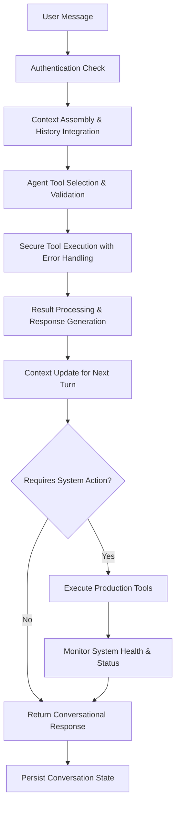

# AI Assistant: Production-Ready Vinyl Collection Management Intelligence

## Executive Summary

The AI Assistant transforms vinyl collection management into an intelligent, conversational experience by leveraging OpenAI's Agents SDK, sophisticated tool orchestration, and production-grade system integration. This system demonstrates advanced AI engineering patterns, agent-based architecture, and enterprise-level reliability—showcasing senior-level capabilities in modern AI development and production system design.

---

## 🎯 Core Technical Achievement

**Agentic AI + Production Tools Integration**: The system combines OpenAI's Agents SDK with custom tool orchestration to create a conversational interface that can search collections, update records, trigger deployments, analyze system health, and manage data with production-grade reliability and error handling.

**Key Innovation**: Instead of simple chatbot responses, the AI assistant operates as a fully-capable system administrator with deep access to collection management, deployment pipelines, and system monitoring—providing human-like assistance backed by robust tooling and enterprise-grade architecture.

---

## 🤖 AI Assistant Architecture

### Core Agent System Design

```typescript
// Production AI Agent (OpenAI Agents SDK)
Music Collection Assistant
├── Conversational Intelligence (GPT-4)
├── Multi-Tool Orchestration System
├── Context-Aware Collection Management  
├── Production Deployment Integration
├── System Health Monitoring & Analysis
└── Enterprise Error Handling & Recovery
```

### Agent Workflow Patterns

**Tool-Driven Decision Making:**
```typescript
// Context-aware tool selection and execution
const musicAgent = new Agent({
  name: 'Vinyl Collection Assistant',
  instructions: `You are a personal vinyl collection assistant...`,
  tools: [
    searchTool, updateTool, addTool, 
    triggerVercelBuildTool, checkBuildStatusTool, 
    errorLogsTool, logAnalysisTool
  ]
})

const result = await run(musicAgent, contextualInput)
```

**Advanced Collection Management Logic:**
```typescript
// Intelligent album lifecycle management
- Search existing collection → Analyze status → Decision tree:
  * Status: "In Collection" → Inform user, offer updates
  * Status: "REMOVED (previously owned)" → Auto-restore with preserved data
  * No results → Add new album to collection
- Context preservation across conversation turns
- Featured album management with UUID-based precision
```

---

## 🧠 Advanced Tool Orchestration

### Production-Grade Tool Architecture

**Secure Tool Context Management:**
```typescript
// Enterprise-level context injection
const toolContext: ToolContext = {
  supabase,  // Authenticated database access
  cookieStore: {
    getAll: () => cookieStore.getAll(),
    set: (name, value, options) => cookieStore.set(name, value, options)
  }
}

// Context-dependent tool initialization
const searchTool = searchAlbumsTool(toolContext)
const updateTool = updateAlbumTool(toolContext)
const addTool = addAlbumTool(toolContext)
```

### Intelligent Tool Selection Patterns

1. **Collection Management Tools**
   - `search_albums`: Multi-dimensional album search with status analysis
   - `add_album`: Smart duplicate detection and restoration logic
   - `update_album_field`: Granular field updates with validation

2. **Production System Tools**
   - `trigger_vercel_build`: Automated deployment pipeline triggering
   - `check_build_status`: Real-time deployment monitoring
   - `search_error_logs`: Comprehensive system health analysis
   - `analyze_error_patterns`: Advanced debugging and trend analysis

3. **Enterprise Data Operations**
   - Input validation and sanitization across all tools
   - Atomic operations with rollback capabilities
   - Comprehensive audit logging and error tracking

---

## 🔧 Conversation Context Engineering

### Stateful Conversation Management

**Multi-Turn Context Preservation:**
```typescript
// Advanced conversation history processing
let contextualInput = latestMessage.content

if (messages.length > 1) {
  const conversationHistory = messages.slice(0, -1)
    .map(msg => `${msg.role}: ${msg.content}`)
    .join('\n')
  
  contextualInput = `Previous conversation:\n${conversationHistory}\n\nCurrent message: ${latestMessage.content}`
}
```

**Context-Aware Decision Making:**
```typescript
// Intelligent restoration vs. addition logic
if (searchResults.status === "REMOVED (previously owned)") {
  // Auto-restore with preserved metadata
  await updateAlbumField(albumId, "removed", "set", false)
  return "Restored album with all original data preserved!"
} else if (searchResults.length === 0) {
  // Add new album to collection
  await addAlbum(title, artist)
}
```

---

## 📊 Production System Integration

### Enterprise Deployment Management

**Automated CI/CD Integration:**
```typescript
// Production build triggering with status monitoring
export const createTriggerVercelBuildTool = (context: ToolContext) => {
  return tool({
    name: 'trigger_vercel_build',
    description: 'Trigger production deployment of Music Central website',
    parameters: z.object({
      reason: z.string().describe('Reason for triggering the build')
    }),
    execute: async (input) => {
      const { triggerVercelDeploy } = await import('@/lib/services/vercel.service')
      return await triggerVercelDeploy(input.reason)
    }
  })
}
```

### Advanced System Health Monitoring

**Comprehensive Error Analysis:**
```typescript
// Multi-dimensional error analysis and pattern detection
const logAnalysisTool = tool({
  name: 'analyze_error_patterns',
  description: 'Advanced error pattern analysis and system health insights',
  parameters: z.object({
    analysis_type: z.enum([
      'trends', 'correlations', 'spike_detection', 
      'error_cascade', 'health_report', 'debugging_insights'
    ]),
    time_range: z.string().optional().default('24h')
  }),
  execute: async (input) => {
    // Complex error pattern analysis logic
    return await analyzeErrorPatterns(input.analysis_type, input.time_range)
  }
})
```

---

## 🔄 Agent Orchestration Workflow

### Production Assistant Lifecycle



### Enterprise Error Recovery Patterns

1. **Graceful Degradation** → Tool failures don't break conversation flow
2. **Context Preservation** → Failed operations maintain conversation state
3. **Automatic Retry Logic** → Transient failures trigger intelligent retries
4. **Comprehensive Logging** → All operations logged for debugging and audit

---

## 🏗️ Senior AI Engineering Patterns

### 1. **Production Agent Architecture**
- OpenAI Agents SDK integration with custom tool orchestration
- Stateful conversation management with multi-turn context preservation
- Enterprise-grade authentication and authorization patterns

### 2. **Advanced Tool Engineering**
- Secure context injection with Supabase authentication
- Input validation and sanitization across all tool interfaces
- Atomic operations with comprehensive error handling

### 3. **Intelligent Collection Management**
- Smart duplicate detection with status-aware restoration logic
- Featured album management with UUID-based precision targeting
- Soft-delete patterns preserving data integrity

### 4. **Production System Integration**
- Automated CI/CD pipeline triggering and monitoring
- Real-time deployment status tracking with user feedback
- Advanced error analysis and system health monitoring

### 5. **Enterprise Reliability Patterns**
- Comprehensive error handling with graceful degradation
- Audit logging and debugging capabilities
- Performance optimization for production workloads

---

## 💼 Technical Leadership Demonstration

This AI Assistant system showcases senior-level capabilities essential for AI Engineering and Production AI System roles:

**🤖 Agent Development & Orchestration:**
- Production-ready OpenAI Agents SDK implementation
- Multi-tool orchestration with intelligent context management
- Conversational AI with enterprise-grade reliability

**🔧 Tool Engineering & Integration:**
- Secure tool context management with authentication integration
- Advanced input validation and error handling patterns
- Production system integration with CI/CD pipeline management

**📊 System Architecture & Reliability:**
- Enterprise error handling with graceful degradation strategies
- Comprehensive logging and monitoring for production debugging
- Performance-optimized tool execution with resource management

**🚀 Production AI Systems:**
- Real-time deployment management with status monitoring
- Advanced system health analysis and error pattern detection
- Scalable conversation management with state preservation

**💡 Conversational Intelligence:**
- Context-aware decision making with multi-turn conversation handling
- Intelligent collection management with complex business logic
- User experience optimization with proactive assistance patterns

---

## 🔐 Security & Production Considerations

### Authentication & Authorization
- Supabase-based authentication with secure session management
- Tool-level authorization with context-dependent access control
- Input sanitization and validation across all interfaces

### Error Handling & Monitoring
- Comprehensive error logging with structured debugging information
- Production monitoring with health checks and alert capabilities
- Graceful failure handling with user-friendly error messages

### Performance & Scalability
- Optimized tool execution with resource management
- Conversation state management with efficient context handling
- Production-ready deployment patterns with CI/CD integration

---

*This project demonstrates the sophisticated AI engineering skills required for senior AI integration roles, showcasing expertise in agent development, production system integration, and enterprise-grade AI architecture.*