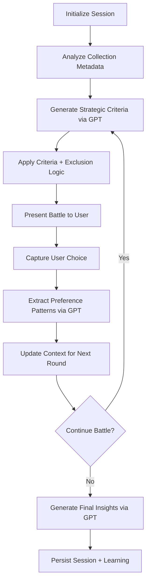

# AI Curator: Personal Vinyl Collection Intelligence

## Executive Summary

The AI Curator transforms a personal vinyl collection into an intelligent recommendation system by leveraging semantic analysis of personal album thoughts, sophisticated prompt engineering, and agentic AI workflows. This system demonstrates advanced AI integration patterns, context engineering, and multi-agent orchestration—showcasing senior-level capabilities in modern AI development.

---

## 🎯 Core Technical Achievement

**Personal Semantic Data + GPT Intelligence**: The system parses personal album reviews, emotional descriptors ("vibes"), and collection metadata through GPT transformers to create a personalized music discovery experience that mimics having the collection owner personally recommend albums.

**Key Innovation**: Instead of generic recommendation algorithms, the AI learns from curated personal thoughts and semantic context to provide recommendations as if the collection owner were personally guiding the user through their vinyl shelf.

---

## 🤖 Agentic AI Architecture

### Multi-Agent System Design

```typescript
// Specialized agent orchestration
AI Curator Agent (GPT-4o-mini)
├── Strategic Album Battle Orchestration
├── Personal Preference Pattern Analysis  
├── Dynamic Criteria Generation
└── Contextual Insight Generation

Collection Management Agent (OpenAI Agents SDK)
├── Semantic Search Tool
├── Collection Update Tool
├── Build Management Tool
└── Error Analysis Tool
```

### Agent Workflow Patterns

**Strategic Decision Trees:**
```typescript
// Context-aware agent branching
if (round === 1 || history.length === 0) {
  criteria = await generateStrategicOpenerCriteria(collectionMetadata, openai)
} else {
  criteria = await generatePersonalizedCriteria(collectionMetadata, history, openai)
}
```

**Tool Factory Pattern:**
```typescript
export const createSearchAlbumsTool = (context: ToolContext) => {
  return tool({
    name: 'search_albums',
    description: 'Search for albums in the collection by title, artist, or other criteria',
    parameters: z.object({...}),
    execute: async (input) => {
      const { searchAlbumsForAgent } = await import('@/lib/search-service')
      return await searchAlbumsForAgent(context.supabase, input.query, input.limit)
    }
  })
}
```

---

## 🧠 Advanced Prompt Engineering

### Context-Aware Dynamic Prompting

**Personal Semantic Data Integration:**
```typescript
const systemPrompt = `You are channeling Hanna's personal music taste and knowledge...

COLLECTION CONTEXT:
Available Genres: ${metadata.availableGenres.join(', ')}
Available Personal Vibes: ${metadata.availableVibes.join(', ')}
Year Range: ${metadata.yearRange.min} - ${metadata.yearRange.max}

LEARNED PREFERENCES:
Albums User Chose: ${chosenDescriptions.join('\n')}
Albums User Rejected: ${rejectedDescriptions.join('\n')}

Generate criteria as if you were Hanna personally selecting albums to compare.`
```

**Multi-Stage Reasoning Chains:**
1. **Pattern Recognition**: Extract preference patterns from battle history
2. **Strategic Selection**: Generate criteria maximizing preference discovery
3. **Contextual Explanation**: Create album-specific reasoning
4. **Insight Generation**: Synthesize learned preferences into actionable insights

### Temperature Strategy for Different AI Tasks

```typescript
// Task-specific temperature optimization
const aiConfigs = {
  criteriaGeneration: { temperature: 0.7, maxTokens: 500 },
  strategicPlanning: { temperature: 0.8, maxTokens: 300 },
  preferenceAnalysis: { temperature: 0.7, maxTokens: 800 },
  conversationalResponse: { temperature: 0.6, maxTokens: 1000 }
}
```

---

## 📊 Personal Data Intelligence Processing

### Semantic Vibe Analysis

**Dynamic Personal Vibe Vocabulary:**
```typescript
// AI-generated semantic descriptors based on album characteristics
const generateVibeVocabulary = (album) => {
  const eraVibes = {
    '1960s': ['revolutionary', 'experimental', 'counterculture'],
    '1980s': ['neon-bright', 'synth-driven', 'bold'],
    '2000s': ['indie-spirit', 'nostalgic', 'digital-era']
  }
  
  const genreVibes = {
    'indie rock': ['introspective', 'atmospheric', 'authentic'],
    'jazz': ['sophisticated', 'improvisational', 'timeless']
  }
  
  return combineContextualVibes(eraVibes[album.decade], genreVibes[album.primaryGenre])
}
```

**Personal Thought Processing:**
```typescript
// GPT analyzes personal album thoughts for preference insights
const analyzePersonalThoughts = async (chosenAlbums, rejectedAlbums) => {
  const prompt = `Based on the personal thoughts and vibes from chosen vs rejected albums:

CHOSEN: ${chosenAlbums.map(a => `"${a.title}" - Thoughts: "${a.thoughts}" - Vibes: ${a.vibes.join(', ')}`)}

REJECTED: ${rejectedAlbums.map(a => `"${a.title}" - Thoughts: "${a.thoughts}" - Vibes: ${a.vibes.join(', ')}`)}

What patterns emerge in this person's musical preferences?`

  return await openai.chat.completions.create({
    model: "gpt-4o-mini",
    messages: [{ role: "user", content: prompt }],
    temperature: 0.7
  })
}
```

---

## 🔧 Context Engineering & State Management

### Multi-Layer Context Preservation

**Conversation Context Stacking:**
```typescript
// Layered context management for agent interactions
let contextualInput = latestMessage.content
if (messages.length > 1) {
  const conversationHistory = messages.slice(0, -1)
    .map(msg => `${msg.role}: ${msg.content}`)
    .join('\n')
    
  contextualInput = `Previous conversation:
${conversationHistory}

Current message: ${latestMessage.content}`
}
```

**Battle Session Context:**
```typescript
// Sophisticated exclusion and diversity management
export function createExclusionSet(
  history: Array<{ chosenAlbum: Album, rejectedAlbum: Album }>,
  albums: Album[],
  options: { 
    keepRecentChoices?: number,
    enableArtistDiversity?: boolean 
  } = {}
): Set<string> {
  // Complex logic for maintaining context across battle rounds
  // while ensuring diversity and preventing repetition
}
```

### Advanced Error Handling & Fallback Strategies

**Robust AI Integration Patterns:**
```typescript
// Comprehensive fallback architecture
try {
  const criteria = JSON.parse(content) as CuratorCriteria
  return criteria
} catch (error) {
  logger.agentError('AI criteria generation', error as Error, {
    round, historyLength: history.length, availableAlbums: albums.length
  })
  
  // Fallback to rule-based criteria generation
  return generateFallbackPersonalizedCriteria(chosenAlbums, metadata)
}
```

**Error Pattern Analysis:**
```typescript
// Advanced debugging with fingerprint-based error tracking
case 'by_fingerprint':
  const fingerprintResults = await logRepository.getLogsByFingerprint(input.fingerprint)
  return formatFingerprintResults(fingerprintResults, input.fingerprint)
```

---

## ⚙️ Advanced Tool Architecture

### Context-Dependent Tool Orchestration

**Granular Field Operations:**
```typescript
// Sophisticated array field manipulation with normalization
if (input.operation === 'add') {
  const normalizedToAdd = toAdd.map(v => String(v).toLowerCase())
  const existingSet = new Set(fieldArray.map((v: string) => v.toLowerCase()))
  const newItems = normalizedToAdd.filter(item => !existingSet.has(item))
  updateData[input.field] = [...fieldArray, ...newItems]
}
```

**Multi-Modal Search Integration:**
```typescript
// Enhanced context gathering from external sources
const tavilyContext = await this.getTavilyContext(album)
const suggestions = await this.generateOpenAISuggestions(album, tavilyContext)
```

### Audio Feature Intelligence

**Weighted Similarity Algorithms:**
```typescript
// Sophisticated audio feature analysis with preference weighting
private calculateAudioSimilarity(features1: SpotifyAudioFeatures, features2: SpotifyAudioFeatures): number {
  const weights = {
    energy: 0.2,
    danceability: 0.2,
    valence: 0.25,        // Emotional content weighted higher
    acousticness: 0.15,
    instrumentalness: 0.1,
    speechiness: 0.05,
    liveness: 0.05
  }
  
  // Multi-dimensional euclidean distance with preference weighting
  return calculateWeightedDistance(features1, features2, weights)
}
```

---

## 🔄 AI Workflow Orchestration

### Battle Session Lifecycle



### Recommendation Generation Workflow

1. **Personal Context Analysis** → Process user's album thoughts, vibes, and battle history
2. **Multi-Dimensional Scoring** → Audio features + Genre similarity + Personal vibes + Temporal preferences  
3. **GPT Enhancement** → Generate explanations and contextual reasoning
4. **Diversification Strategy** → Balance familiarity with exploration opportunities

---

## 🏗️ Senior AI Engineering Patterns

### 1. **Multi-Agent Orchestration**
- Specialized agents for different cognitive tasks
- Context sharing between agents
- Tool-equipped agents with dynamic tool selection

### 2. **Advanced Prompt Engineering**
- Dynamic prompt construction with multiple context layers
- Task-specific temperature and token management
- Multi-stage reasoning chains with fallback strategies

### 3. **Personal Data Intelligence**
- Semantic analysis of personal album thoughts and emotional descriptors
- Context-aware preference pattern extraction
- Real-time learning from user behavior

### 4. **Robust Context Management**
- Multi-layer context preservation across conversations
- Session state management with intelligent exclusion logic
- Error pattern analysis with fingerprint-based tracking

### 5. **Production-Ready AI Integration**
- Comprehensive error handling with fallback strategies
- Performance optimization for AI API calls
- Secure context management and data processing

---

## 💼 Technical Leadership Demonstration

This AI Curator system showcases senior-level capabilities essential for AI Integration and Agentic AI Development roles:

**🤖 Agentic AI Development:**
- Multi-agent system architecture with specialized cognitive roles
- Tool orchestration patterns with context-dependent factories
- Advanced conversation state management across agent interactions

**🧠 AI Workflow Engineering:**
- Sophisticated prompt engineering with dynamic context injection
- Multi-stage reasoning chains with error recovery
- Temperature and token optimization strategies

**🔧 Context Engineering:**
- Personal semantic data processing through GPT transformers
- Multi-layer context preservation and state management
- Intelligent exclusion and diversity algorithms

**📊 AI Integration Patterns:**
- Robust fallback strategies for production reliability
- Performance-optimized AI API usage with caching
- Comprehensive error analysis and pattern recognition

**🎯 Personal AI Systems:**
- Transform personal data into intelligent recommendation systems
- Semantic analysis of personal thoughts and preferences
- Context-aware personalization that mimics human expertise

---

*This project demonstrates the sophisticated AI engineering skills required for senior AI integration roles, showcasing expertise in agentic AI development, advanced prompt engineering, and production-ready AI system architecture.*